# FCM Component
----
_A device comprises one or more functional components. The concept of such a component is described in this document._

---
## Description
A _component_ is implemented as a subclass of the ```FcmComponent``` class. It implements a specific part of behavioral functionality of the device which is reflected in the name of the component which is set at the initialization of the component.
```cpp
const std::string name;
```
The name of the component can be freely chosen. However, it is good practice to have the name reflect the component's functionality in a sense that it answers the question as to what the component does, e.g. "I am a &lt;Component Name&gt;". Doing this makes it much easier to understand the device architecture, ensuring a modular design and preventing errors, mistakes and inefficient architectures.

The name is used to identify and display the component in the component diagram.

```plantuml
@startuml
hide stereotype
skinparam componentStyle rectangle
skinparam defaultTextAlignment center

skinparam {
  InterfaceFontSize = 9
}

component ConnectionHandler as "Connection\nHandler"
@enduml
```



